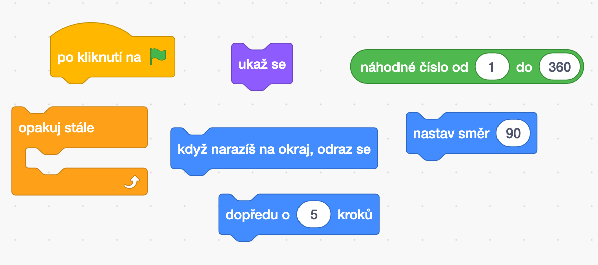
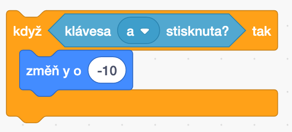

# Pong

Posledně jsme si říkali, že by byla sranda si zahrát nějakou hru proti sobě na jednom počítači. Pojďme si naprogramovat a zahrát pong! Pong je něco jako ping-pong, jen o hodně jednodušší.

Na skoro hotový pong se můžete podívat na [https://scratch.mit.edu/projects/436444452](https://scratch.mit.edu/projects/436444452).

Pokud si s některým krokem nebudete vědět rady, mrkněte, jak to mám udělané já.

Následuje návod, jak si naprogramovat základní vlastní verzi pongu. Tento týden rozpohybujeme míček a naučíme ho odrážet od pálek, příští týden přidáme gúly a body!

Tak směle do toho.

# Od strany ke straně

Začneme tím, co jsme dělali posledně. Rozpohybujte míček tak, aby se po zmáčknnutí  pohyboval a odrážel od stěny. Budete k tomu potřebovat následující bloky.

# Pálka

Teď na obrazovku přidáme levou pálku a naučíme ji pohybovat se nahoru po stisknutí klávesy "q" a dolů po stisknutí klávesy "a".

Začněte tím, že přidáte postavu pálky a pojmenujete ji "palka vlevo". Nastavte vhodnou velikost a pálku můžete otočit nastavením směru. Na následujícím obrázku jsem vám vyznačil červenými obdélníky, kde se nastavuje jméno, velikost a otočení postavy.

## Podmínka

Budeme k tomu potřebovat nové programátorské slovo "podmínka". Blok podmínky se provede jenom v tom případě, kdy je podmínka splněna. Ukážeme si to na příkladu. 

V programu níže - když je klávesa "a" stisknuta, tak změň y o -10. Tedy se přesně provede, co potřebujeme udělat s pálkou, posune se dolů.

## Nahoru a dolů

Zkuste nyní zkombinovat bloky tak, aby pálka jezdila nahoru po stisknutí "q" a dolů po stisknutí "a". Nezapomeňte si navolit k programování pálku, aby se vám nestalo, že budete jezdit nahoru a dolů s míčkem.

Bloky, které budete potřebovat.

## Druhá pálka

Když máme jednu pálku nalevo hotovou, není nic jednoduššího, než ji zkopírovat, přesunout napravo a nastavit jí, že se má pohybovat nahoru po stisknutí šipky nahoru a dolů po stisknutí šipky dolů.

Pohrajte si s s hodnotou v bloku "změň y o 10" a sledujte, jak se mění rychlost pohybu pálky.

První hráč hraje vlevo a druhý hráč hraje vpravo.

# Odraz od pálky

Teď potřebujeme, aby se míček odrazil od pálky, když do ní narazí. Všechny bloky, které použijeme, již známe. Vyberte míček a naprogramujte ho tak, aby se odrazil od levé pálky.

Zvládnete doplnit další kousek programu, aby se míček odrazil od pálky vpravo?

Příští týden budeme pokračovat. Ukážeme si, jak přidat góly a jak počítat body!
