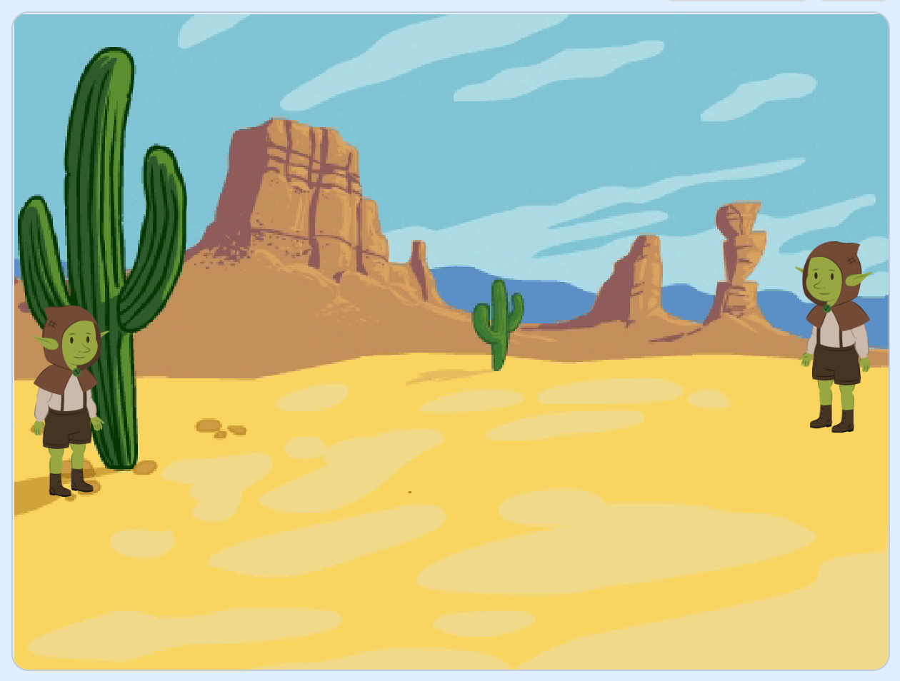
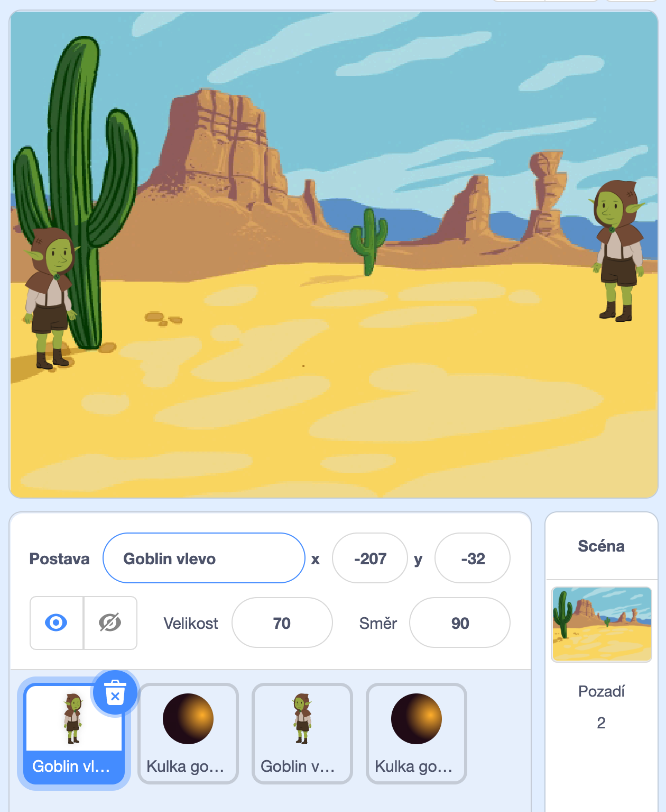
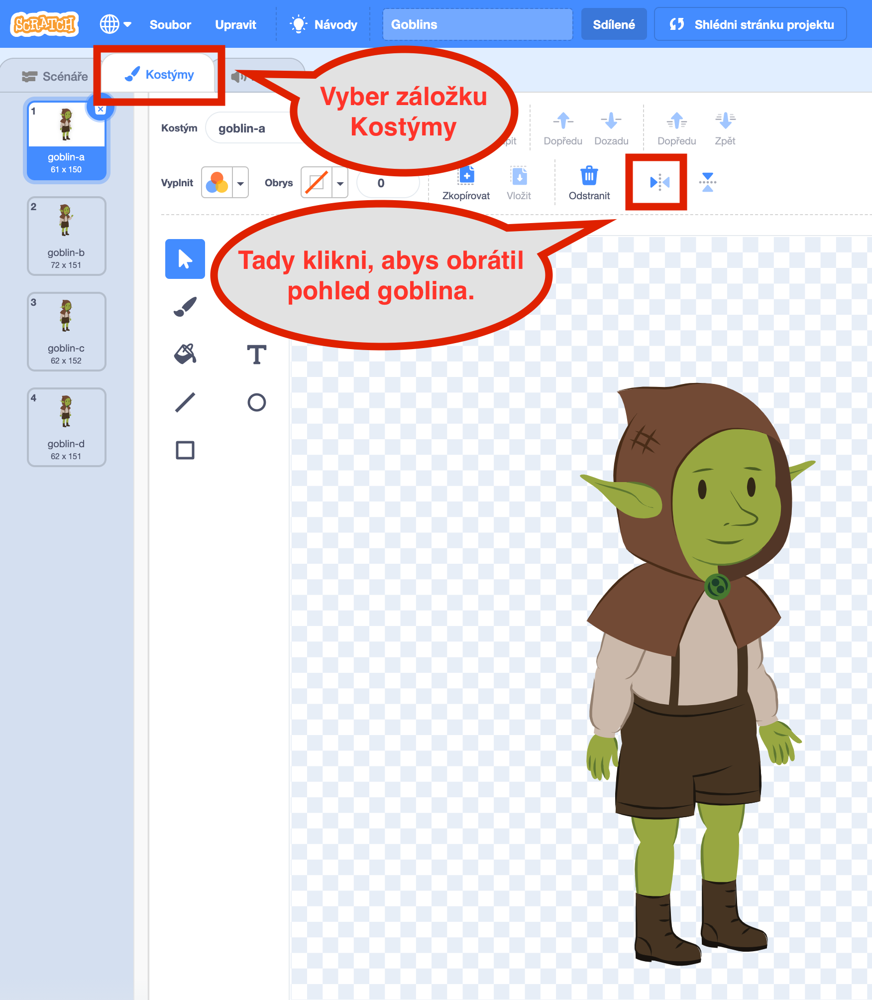
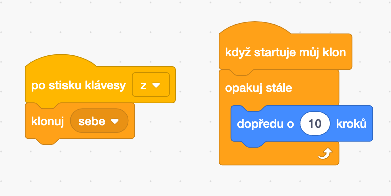
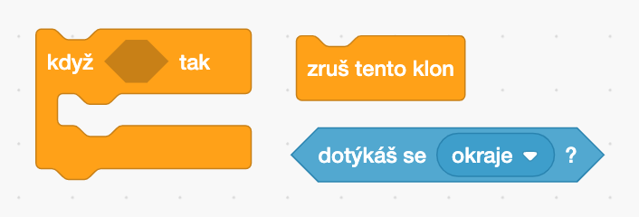
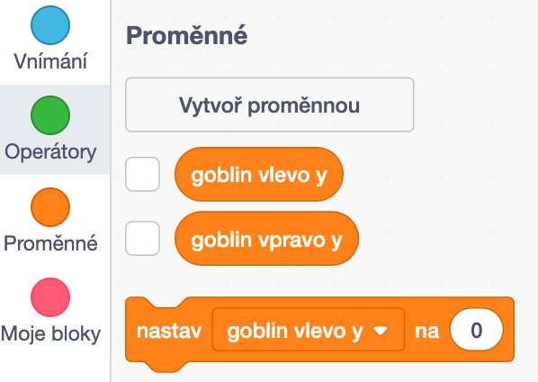
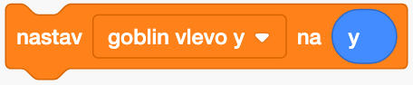
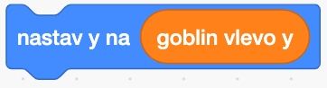

# Goblins

[Posledně](../02-Pong/pong.md) jsme si ukázali, jak ovládat pálku pomocí klávesnice. Tentokrát navážeme a zahrajeme si dva gobliny, kteří po sobě stříli a vyhýbají se střelám. Opět si zahrajeme hru proti sobě na jednom počítači. 

Na skoro hotové gobliny se můžete podívat na [https://scratch.mit.edu/projects/445900661](https://scratch.mit.edu/projects/445900661).

Pokud si s některým krokem nebudete vědět rady, mrkněte, jak to mám udělané já.

Následuje návod, jak si naprogramovat vlastní gobliny. 

# Goblin

Začneme tím, co už umíme z minula. Zvolte si dobré pozadí a přidejte goblina nebo jinou postavičku doleva, nastavte vhodnou velikost a pojmenujte postavičku třeba `Goblin vlevo`, aby se nám v postavičkách dobře orientovalo.

Naučíme goblina se pohybovat na stisk klávesy `q` nahoru a na stisknutí klávesy `a` dolů. Budeš k tomu potřebovat následující bloky.

Teď zkopíruj hotového goblina, umísti vpravo, pojmenuj ho `Goblin vpravo`, otoč směrem ke goblinovi vlevo a nastav tak, aby se pohyboval nahoru a dolů podle stisknutých šipek.

Goblina otočíš pohledem doleva tak, že ho vybereš, zvolíš Kostým a klikneš na Přetočit horizontálně. Obrázek pomůže.

# Kulka

Přidej postavu kulky, já jsem si vybral Ball, který jsme používali i v Pongu a trochu jsem ho přebarvil a zmenšil, aby vypadal jako kulka z pistole.

Kulku pojmenuj `Kulka goblina vlevo`, sestav pro ni následují program, zmáčkni zelenou vlajku, pak `z` a sleduj, co se stane. Co se stane, když `z` zmáčkneě nekolikrát po sobě?

Po stisknutí `z` jsme v levém bloku naklonovali (skopírovali) sama sebe, tedy postavu kulky, a v pravém bloku jsme ji vystřelili doprava rychlostí 10 kroků.

Kulka nám ale zůstala "viset" na pravém okraji obrazovky, co s tím? Zkus přidat následující podmínku, která zruší tento klon kulky, když narazí na kraj obrazovky.

Paráda, už strílíme. Teď schovej vzor postavy kulky a k `když startuje můj klon` přidej, aby se klon - tedy kulka - objevila po každém stisknutí `z`. A už střílíme!

Do programu kulky teď přidej podmínku, která zruší kulku, pokud trefí goblina vpravo. Je to podobné, jako se zmizením po nárazu do kraje obrazovky. Můžeš přidat i nějaký zvuk, například výbuch :)

## Goblin střílí

Tak a teď to nejtěžší. Kulku by měl goblin vystřelit zhruba z místa, kde má ruku, ať už s goblinem pohybuješ nahoru nebo dolů, jak chceš. 

Budeme muset přidat bloky jak do programu goblina, tak do programu kulky. Při pohybu s goblinem si musíme vždy zapamatovat do proměnné, jakou má goblin polohu na ose y, tedy na ose, která jde směrem nahoru a dolů.

Vytvoříme tedy novou proměnnou a pojmenujeme ji `goblin vlevo y`.

Nebudeme proměnnou zaškrtávat, protože nepotřebujeme, aby se nám na herní obrazovce zobrazovala, potřebujeme ji jenom na to, abychom si do ní uložili pozici goblina v levo na ose y.

V programu goblina si na vhodném místě uložíme do proměnné `goblin vlevo y` aktuální polohu goblina na ose y.

a do programu kulky přídáme, aby se poloha na ose y nastavila na hodnotu uloženou v proměnné `goblin vlevo y`.

## Goblin vpravo

Program druhého goblina vpravo je hodně podobný. Zkopírujeme kulku, nastavíme její směr na -90, posuneme ke goblinovi vpravo a schováme. Pro nastavení polohy použijeme proměnnou `goblin vpravo y`.

Podařilo se?

# Rozšíření

Můžeš třeba přidat zvukové a vizuálni efekty, počítat body, přidat třeba kaktus o který se kulky zastaví, goblini mohou po zásahu červenat a ztrácet životy. Určitě vymyslíš jak hru vylepšit!
