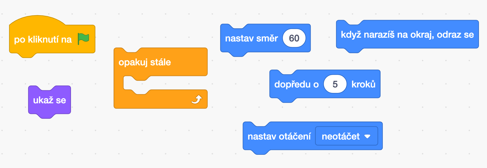
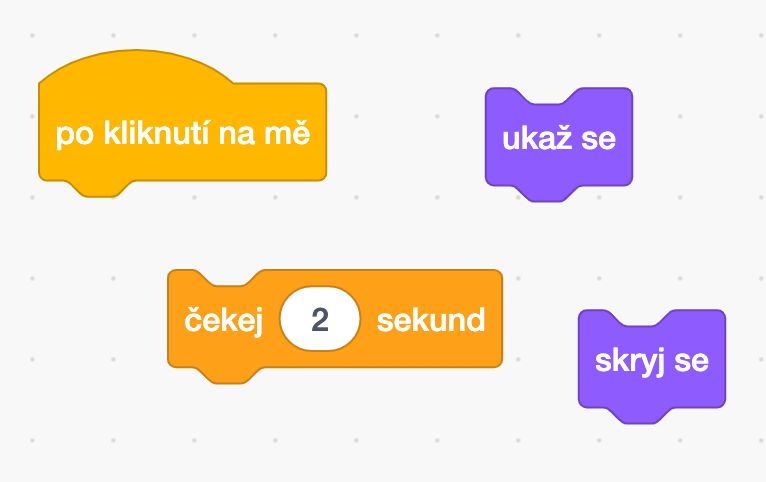
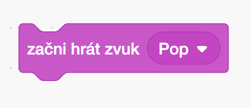
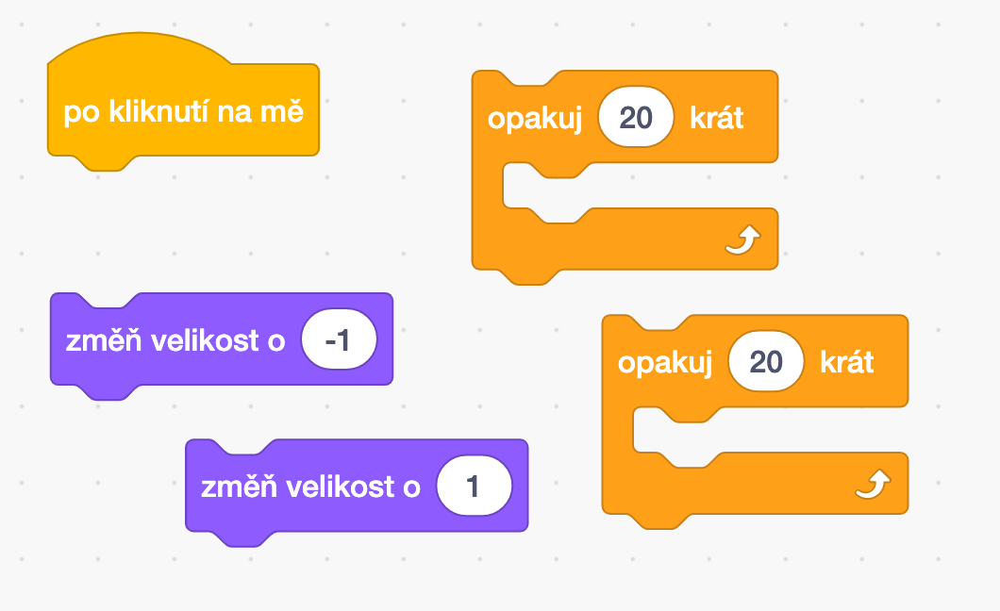
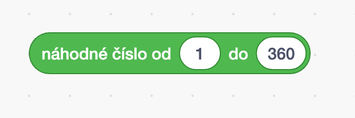
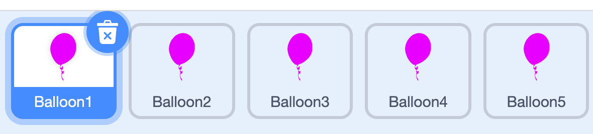
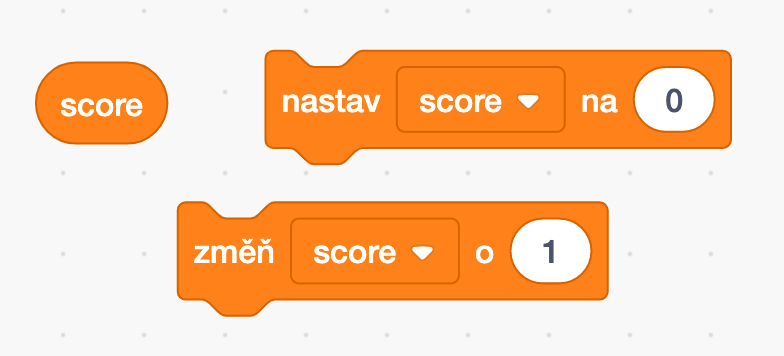

# Jeden balónek

Pohybuje se po obrazovce a odráží od stran.

# Po kliku zmiz

# Co by ještě mohl balónek udělat?

nebo něco úplně jiného?

# Nastavíme směr

# Hodně balónků

Jaké ještě bychom mohli balónky mít?

# Score

Přidejme počítání bodů

# Co dál?

[https://scratch.mit.edu/projects/433332541](https://scratch.mit.edu/projects/433332541)
